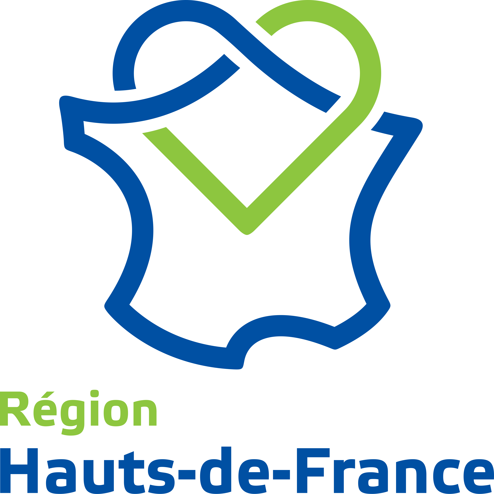
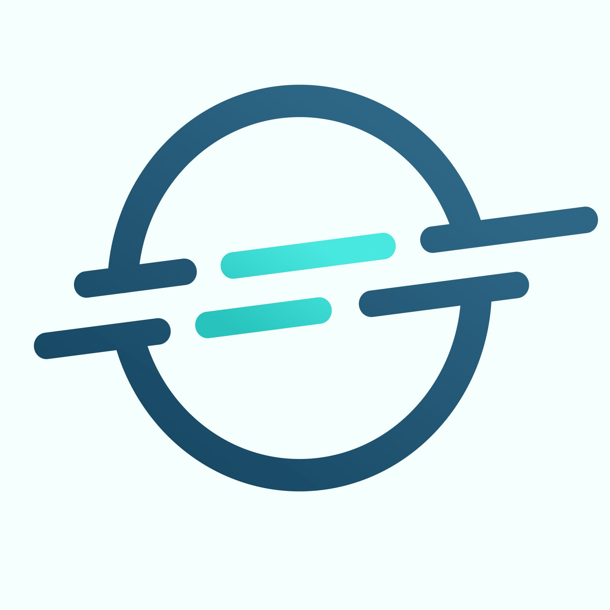

# 👋 Bonjour je m'appelle David !

### 👨‍💻 Je travaille actuellement au sein d'une mutuelle dans la région des Hauts-de-France 
---

### 👨‍🎓 En ce moment
Je suis une formation au sein de l'organisme Jedha  pour obtenir les diplômes de :
* 📊 Concepteur Développeur en Science de la Données
* 🤖 Architecte en Intelligence Artificielle 

---
### 📝 Blocs de certification
*  CDSD
    *   [Bloc 1](https://github.com/David62690/Jedha_certif_bloc1) - Projet Kayak - Construction et alimentation d'une infrastructure de gestion de données
    *   [Bloc 2](https://github.com/David62690/nom-du-repo) - Description courte du projet - Analyse exploratoire, descriptive et inférentielle de données
    *   [Bloc 3](https://github.com/ton-pseudo/nom-du-repo) - Description courte du projet - Analyse prédictive de données structurées par l'intelligence artificielle
    *   [Bloc 4](https://github.com/ton-pseudo/nom-du-repo) - Description courte du projet - Analyse prédictive de données non-structurées par l'intelligence artificielle
    *   [Bloc 5](https://github.com/ton-pseudo/nom-du-repo) - Description courte du projet - Industrialisation d'un algorithme d'apprentissage automatique et automatisation des processus de décision
    *   [Bloc 6](https://github.com/ton-pseudo/nom-du-repo) - Description courte du projet - Direction de projets de gestion de données
---

### 🛠️ Mes outils préférés
| Catégorie | Technologies |
| :--- | :--- |
| **Langages** |  |
| **Outils** |   |

---

### 📈 Mes Statistiques GitHub

---

*Dernière mise à jour : Mai 2026*
